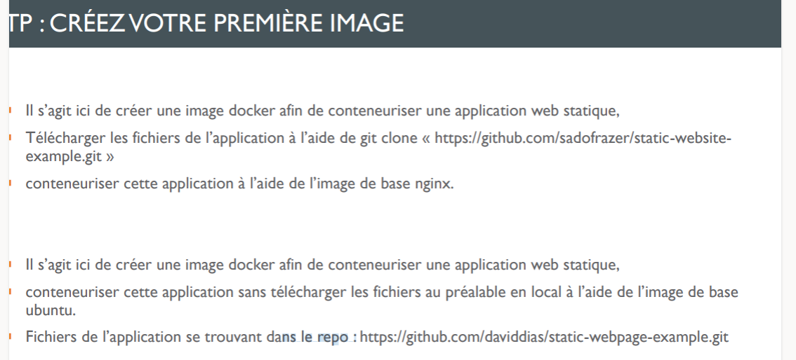

# devopsLamp
```bash
docker-compose up 
```

# devopsDockerFile
### subject


```bash
docker build -t name_image path
```

```bash
docker run -p 8080:80 name_image
```


# List container/images
- List des containers
```bash
docker ps -a
```

- List des images
```bash
docker images
```
# RM container/images
- RM conainers
```bash
docker rm id_container
```

- RM image
```bash
docker rmi name_image
```
